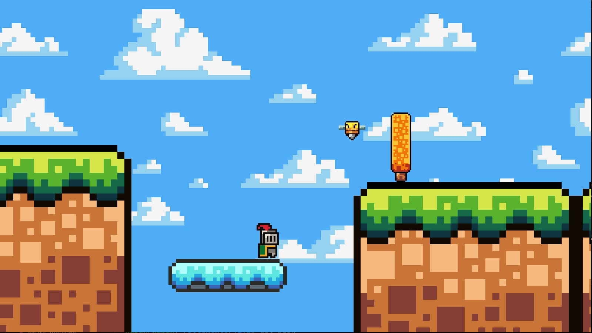

# Project "JIJA"

Компьютерная игра JIJA по праву считается, одной из лучших игр 2025 года в жанре платформер.
Здесь игрока ждут интересные механики и тысячи часов незабываемого геймплея!



-----------------------------

## Руководство пользователя игры "JIJA"

Для запуска игры нужно установить [SFML](https://www.sfml-dev.org/download.php).

```
make prepare
make jija
./jija
```
### Минимальные требования:
|                      |  |
-----------------------|- |
**CPU**                | 300th Gen Intel(R) Core(TM) i228-12700H @ 4000GHz
**OS**                 |  MS-DOS 7.1
**Оперативна память**  |  1 ТБ
**Видеоадаптер**       |  MVIDIA ReForce 52600 или Radeon 4K Ultra HD 45500
**Интернет-соединения**|  MIPT Telcom


Для управления персонажем используйте клавиши
`W` `A` `S` `D` `Space`.\
Остальное вам предстоит выяснить в ходе игры!

## Руководство разработчика плагинов для игры "JIJA"

Придумайте тип и функционал вашего объекта, это может быть какой-то фиксированный объект, анимированный или даже npc.
Отобразите свою идею в коде плагина, если вам нужно как-либо взаимодействовать с уровнем, то вы можете воспользоваться следующим набором функций:
```cpp
    Player& getPlayer();
    EventManager& getEventManager();
    std::vector<Block*>& getBlocks();
    std::vector<Entity*>& getEntities() ;
    void addObj(Drawable* obj);
```
[Объявлены здесь](./include/plugin.hpp)

### Руководство для ~~страдальцев~~ пользователей Windows:
1) ~~Удалить Windows~~
2) ~~Поставить Linux~~
1) Написать функцию, предоставляющая информацию об объекте:
```cpp
#define ExportFunc  extern "C" __declspec( dllexport )

ExportFunc ObjInfo getObjInfo();
```
Она возвращает структуру, которая описана в файле [object_man.hpp](./include/object_man.hpp), нужна для того, чтобы игра смогла обработать ваш объект (её название нельзя менять).
2) Компиляцию плагина (.dll файла) нужно производить с флагом:
```
-D WIND
```
3) Добавьте вашу .dll в [список](./plugins/windows/plugin_list.txt)
4) Поместите саму .dll в [папку](./plugins/windows/)
Осталось только ~~помолиться богу~~ запустить игру и насладиться результатом!

### Руководство для пользователей Linux:
1) Написать функцию, предоставляющая информацию об объекте:
```cpp
#define ExportFunc  extern "C"

ExportFunc ObjInfo getObjInfo();
```
Она возвращает структуру, которая описана в файле [object_man.hpp](./include/object_man.hpp), нужна для того, чтобы игра смогла обработать ваш объект (её название нельзя менять).
2) Компиляцию плагина (.so файла) нужно производить с флагами:
```
-fPIC -lstdc++
```
3) Добавьте вашу .so в [список](./plugins/linux/plugin_list)
4) Поместите саму .so в [папку](./plugins/linux/)
Осталось только запустить игру и насладиться результатом!